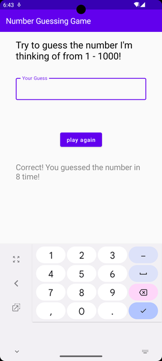

# cn333as1
# NumberGuessingGame

เกมทายตัวเลข ที่มีค่าตั้งแต่ 1-1000
Using App :

 

## clipสาธิตการทำงานของเกมทายตัวเลข
https://drive.google.com/file/d/1WVH_I-fq4ntn-8SRidNetnHlqNPKq5Al/view?usp=sharing

## Members

* Sireetorn Ontrakul 6310611048

* Chutirat Kaewchay 6310682643

## รูปแบบหน้าจอแสดงผล

  

## การทำงานของเกม

1. เกมจะเริ่มเมื่อผู้ใช้ทำการกรอกตัวเลขที่จะทายลงในช่อง Your Guess เสร็จแล้วทำการกด ปุ่ม Play agian 

   OUTPUT : จะแสดง Hint ใน 2 รูปแบบคือ 
    + It's Lower = ตัวเลขมีค่าต่ำกว่าตัวเลขที่ผู้ใช้ทาย
    + It's Higher = ตัวเลขมีค่าสูงกว่าตัวเลขที่ผู้ใช้ทาย

  

2. ทำการทายเลขไปเรื่อยๆ เมื่อตัวเลขที่ผู้ใช้ทายตรงกับตัวเลขของเกมที่กำหนด 

   OUTPUT : จะแสดงข้อความ Correct! และแสดงจำนวนครั้งที่ผู้ใช้ทำการทาย
  
  
  
3. เมื่อจะทำการเริ่มเล่นใหม่ ผู้ใช้สามารถกรอกตัวเลขที่จะทายและทำการเริ่มเล่นตามวิธีที่ได้กล่าวมาตามข้อ 1 และ 2 ข้างต้น

